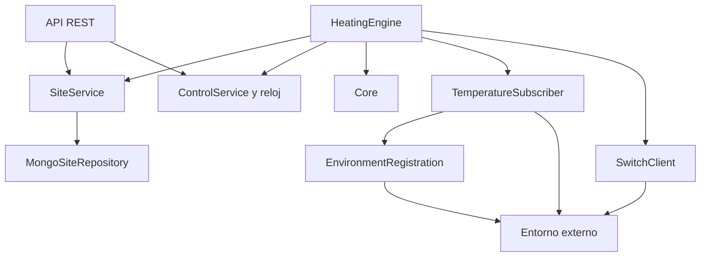
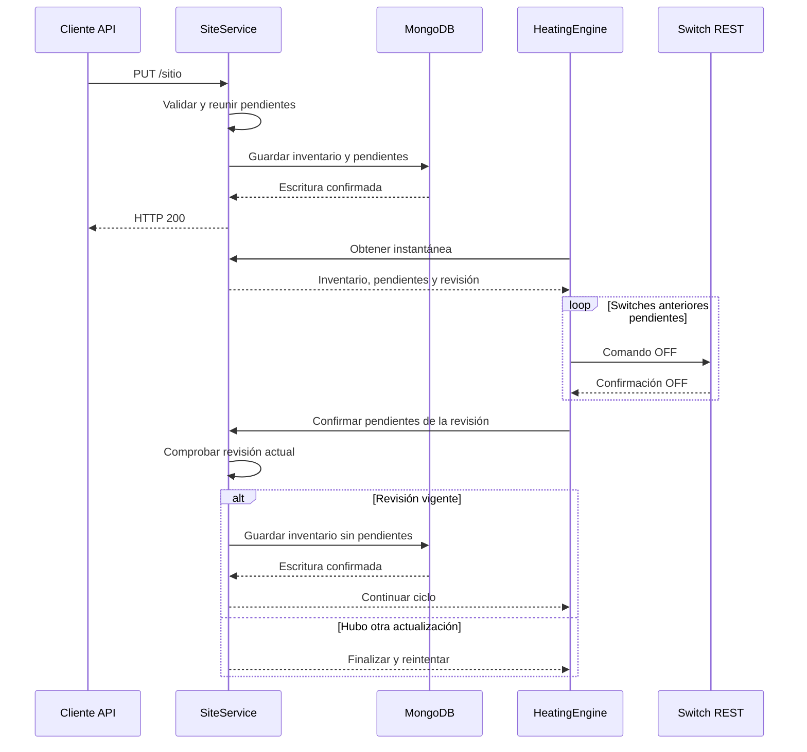
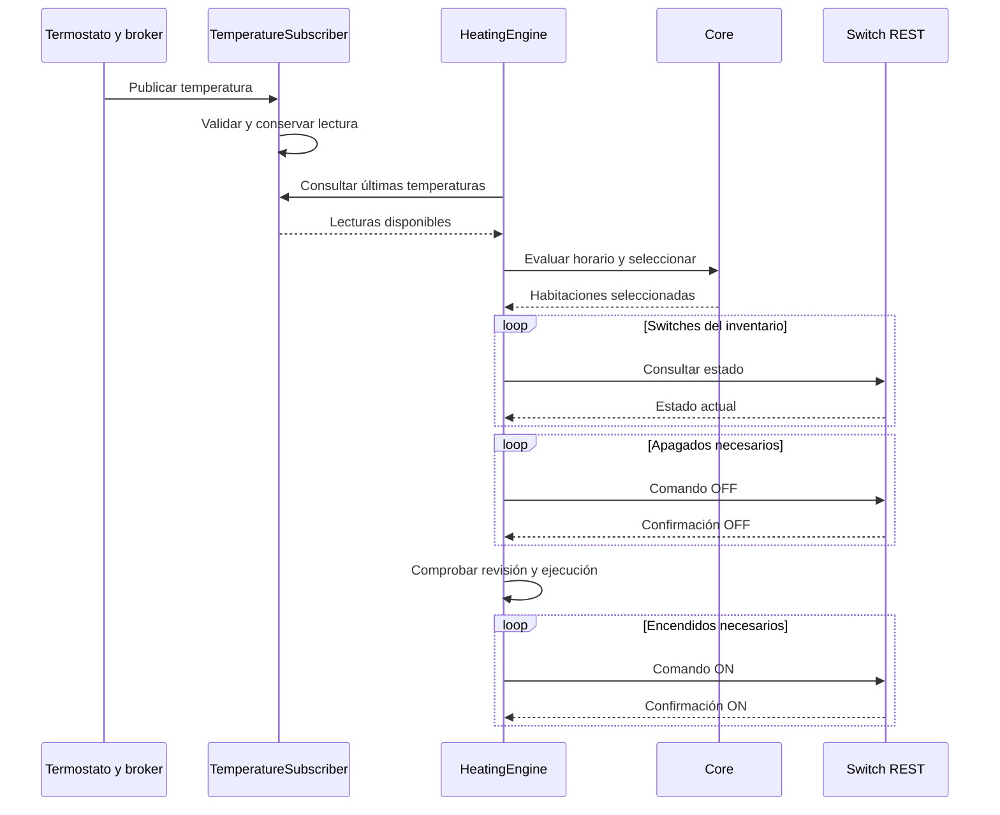

# Arquitectura 4+1 — Iteración 4

## Alcance

Esta iteración documenta la vista lógica y escenarios mediante
diagramas de secuencia. Las restantes vistas se completarán
en las siguientes iteraciones.

## Vista lógica

El proyecto tiene dos módulos Maven:

- core: reglas de decisión, sin comunicaciones externas.
- engine: API REST, reloj virtual, persistencia e integración MQTT/REST.

Engine depende de core. Core no depende de engine.

SiteService no depende de SwitchClient.
Las llamadas REST a switches corresponden al motor.

### Responsabilidades

| Componente | Responsabilidad |
|---|---|
| HeatingController | Seleccionar habitaciones dentro de la potencia disponible |
| PeakSchedule | Evaluar la franja punta |
| RoomState | Representar los datos de decisión de una habitación |
| SiteController | Exponer GET y PUT `/sitio` |
| SiteService | Validar y persistir inventario y apagados pendientes |
| SiteValidator | Validar la configuración recibida |
| SiteRepository | Definir las operaciones de persistencia |
| MongoSiteRepository | Guardar y recuperar el documento de configuración |
| ControlController | Exponer estado y comandos del control |
| ControlService | Administrar estado, reloj y desplazamiento horario |
| VirtualClock | Calcular el avance del tiempo virtual |
| EnvironmentRegistration | Registrar el controlador y obtener el broker |
| TemperatureSubscriber | Recibir y conservar las últimas temperaturas |
| HeatingEngine | Procesar pendientes y ejecutar las decisiones |
| SwitchClient | Consultar y comandar switches REST |
| SecurityConfig | Comprobar `X-API-Key` |
| ApiExceptionHandler | Estandarizar los errores REST que maneja |

## Decisiones de diseño

### Core independiente

El core trabaja con datos de temperatura, objetivos, potencia
y horario. No utiliza Spring, MongoDB ni comunicaciones.

Esto permite probar las decisiones con datos controlados.

### Selección de habitaciones

La prioridad se calcula por:

`temperatura objetivo - temperatura actual`

Se ordena por mayor déficit y se desempata por identificador.
Una habitación se selecciona si su potencia cabe en la potencia restante.

Durante punta no se seleccionan habitaciones.
Las habitaciones sin temperatura disponible tampoco se seleccionan.

### Tiempo virtual y hora local

El reloj calcula:

`instante inicial + tiempo real transcurrido × factor`

INICIAR crea o resincroniza el reloj y conserva el desplazamiento
horario recibido.

La tarifa utiliza esa hora local:
17:00-03:00 se evalúa como las 17:00.

GET `/control` representa el instante en UTC, con Z.
El desplazamiento permanece fijo hasta otro INICIAR.
No se aplican cambios de horario estacional.

La franja incluye el inicio y excluye el final: `[desde, hasta)`.

HABILES representa lunes a viernes.
TODOS representa todos los días.

### Inventario y persistencia

MongoDB conserva un documento en `site_config`, con `_id: active`.

El documento contiene:

- `inventory`: configuración activa.
- `pendingShutdowns`: habitaciones cuyos switches anteriores deben apagarse.

Al cambiar el inventario, SiteService valida y guarda ambos campos
en una misma escritura antes de actualizar la memoria.

Los pendientes existentes se conservan y se agregan los switches
del inventario anterior. Se mantienen sus direcciones originales,
aunque desaparezcan de la nueva configuración.

PUT `/sitio` no llama a los switches.

Un inventario idéntico no produce otra escritura ni agrega pendientes.
Si falla la persistencia, el inventario en memoria permanece anterior.

Los documentos anteriores que no contienen `pendingShutdowns`
se interpretan con una lista vacía.

### Procesamiento de apagados pendientes

HeatingEngine obtiene una instantánea con inventario, pendientes
y número de revisión.

Primero intenta apagar los switches pendientes.
Si alguno falla, el ciclo termina y conserva los pendientes.

Cuando todos confirman OFF, el motor pide retirar los pendientes.
SiteService comprueba que la revisión siga siendo actual.

Si hubo otra actualización, la confirmación de la revisión anterior
no borra los pendientes de la nueva.

Los apagados se procesan incluso con el control detenido.
No se evalúan nuevos encendidos hasta completar esta etapa.

Los pendientes sobreviven a un reinicio porque están en MongoDB.

### Concurrencia

SiteService sincroniza las operaciones que cambian inventario
y pendientes. ControlService sincroniza estado y reloj.

HeatingEngine evita ejecutar dos ciclos propios simultáneos.

Las llamadas HTTP a los switches se realizan sin mantener
bloqueados SiteService ni ControlService.

Antes de enviar encendidos, el motor comprueba que siga vigente
la revisión del inventario y que no haya cambiado la ejecución.

Estas comprobaciones descartan ciclos anteriores, pero no convierten
los comandos REST y las actualizaciones locales en una transacción
distribuida. Un comando que ya está en curso puede finalizar después
de una actualización; los ciclos siguientes realizan la reconciliación.

### Integración externa

El controlador se registra con POST `/controladores`.
La respuesta indica el broker MQTT.

TemperatureSubscriber actualiza las suscripciones según el inventario.
Las lecturas recibidas se conservan en memoria.

Recibir una temperatura no envía directamente un comando:
HeatingEngine consulta las últimas lecturas en su ciclo periódico.

## Escenario de actualización del inventario

Si un apagado falla, el motor interrumpe esa etapa sin retirar
los pendientes ni continuar con nuevos encendidos.

## Escenario de temperatura y decisión

Precondiciones:

- Inventario cargado.
- Control en ejecución.
- MQTT conectado y suscripciones establecidas.
- Apagados pendientes procesados.

## Otros comportamientos

- DETENER cambia el estado a DETENIDO; el siguiente ciclo intenta
  apagar los switches activos y reintenta los fallos.
- El registro se reintenta mientras no haya respuesta válida.
- MQTT utiliza reconexión automática.
- Temperaturas, estado de ejecución y reloj se mantienen en memoria.
- Inventario y apagados pendientes se recuperan desde MongoDB.

## Validación

El 6 de octubre de 2026, hora de Uruguay:

| Módulo | Pruebas aprobadas |
|---|---:|
| core | 15 |
| engine | 34 |
| Total | 49 |

Resultado: `BUILD SUCCESS`, sin fallos, errores ni pruebas omitidas.

Checker sobre el controlador reconstruido:

- 8/8 comprobaciones aprobadas.
- PUT `/sitio`: HTTP 200.
- 11 comandos y 88 consultas a switches.

Las pruebas unitarias incluyen recuperación de pendientes,
protección frente a revisiones anteriores, fallo de apagado
y procesamiento de pendientes con control detenido.

La recuperación de pendientes está comprobada con repositorios
simulados; queda ampliar su validación con infraestructura real.

El checker acredita interoperabilidad en el escenario ejecutado.
Las pruebas de endurecimiento y las restantes vistas arquitectónicas
se ampliarán en las siguientes iteraciones.